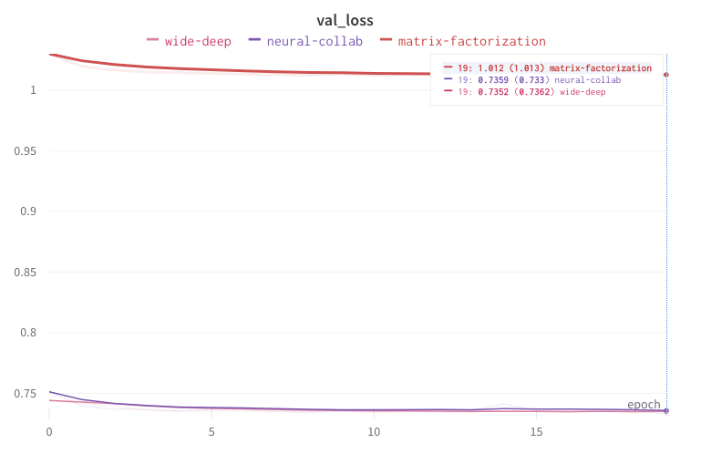
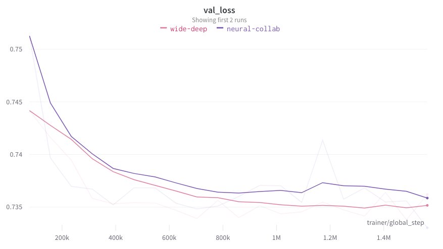

# MovieLens 25M

This is a cross-comparison of three recommender systems trained on the [MovieLens 25M dataset](https://grouplens.org/datasets/movielens/25m/).

The three models are Vanilla matrix factorization with bias, a neural network with a concatenated embedding vector, and the [Wide and Deep model](https://arxiv.org/abs/1606.07792). 

The full training report can be viewed here. The neural network models performed far better than matrix factorization. 

Wide and deep performed slightly better, but the difference would probably have been bigger if more features were used in training.

Demo URL: https://klingefjord-recommenders-streamlit-app-ri6m6z.streamlit.app/

